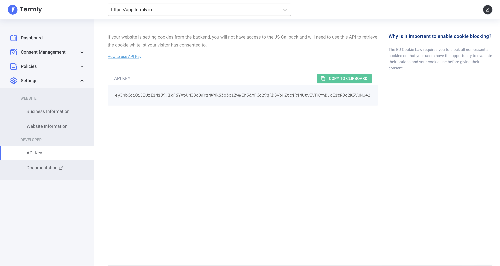

The Termly API is organized around REST. Our API has predictable resource-oriented URLs, accepts form-encoded request bodies, returns JSON-encoded responses, and uses standard HTTP response codes, authentication, and verbs.

## Authentication

The Termly API uses API keys to authenticate requests. You can manage your API keys in the [Termly Dashboard](https://app.termly.io/dashboard). Look for the `API Keys` section in the left sidebar.

## Further reading

- Checkout out our [API Reference](https://github.com/termly/apidocs/tree/main) on GitHub
